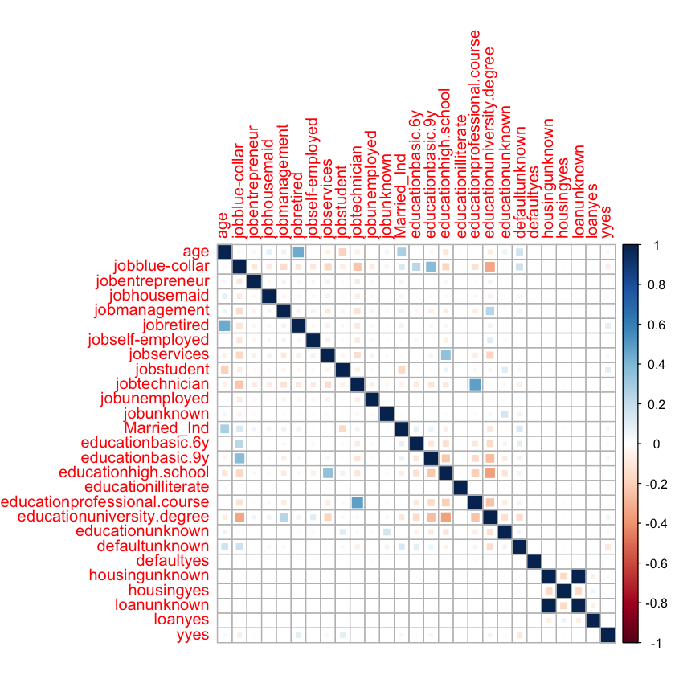
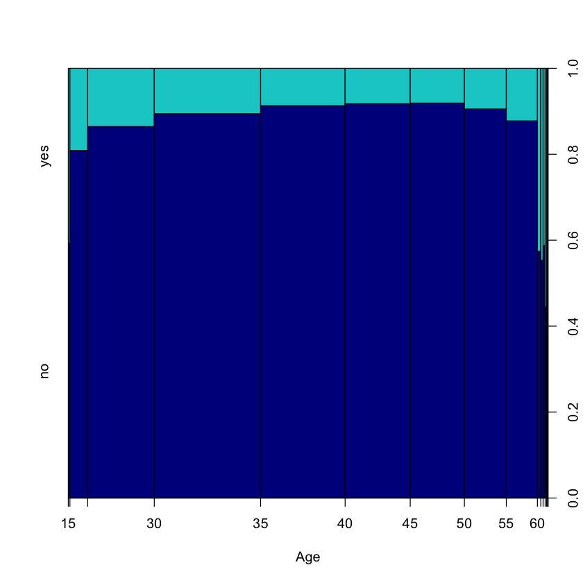
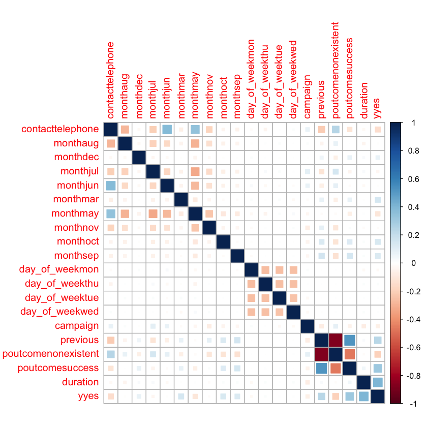
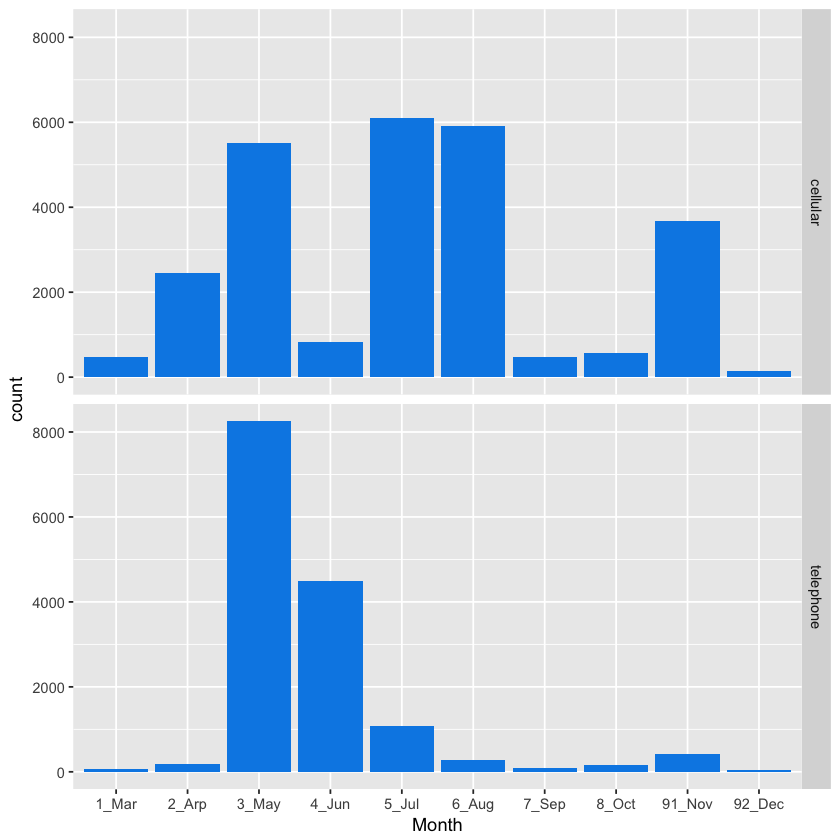
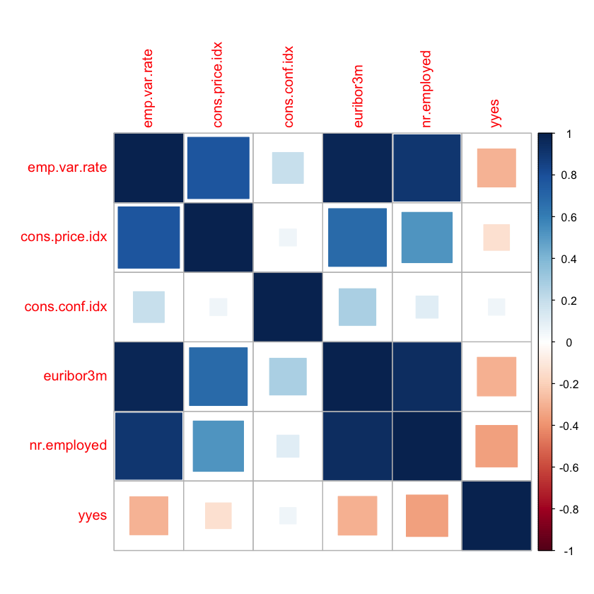
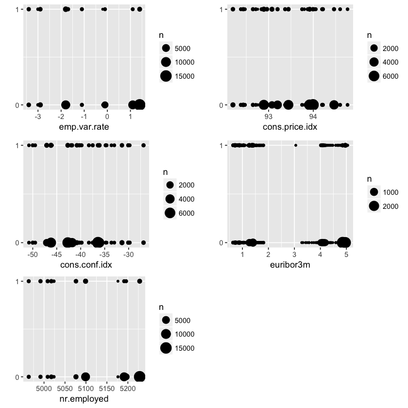
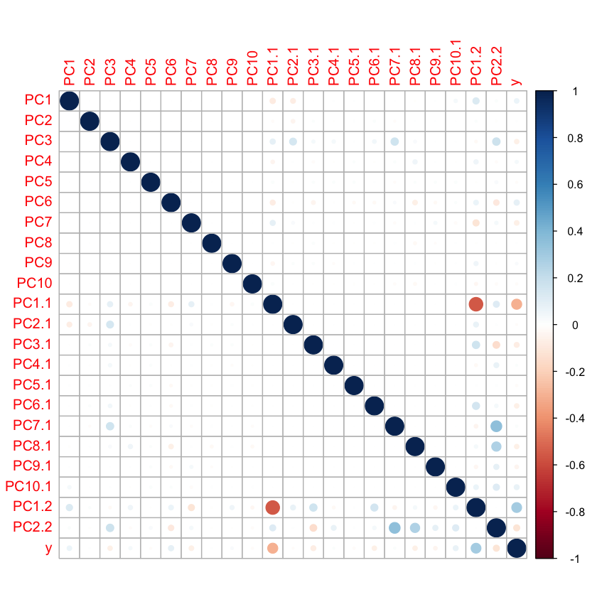
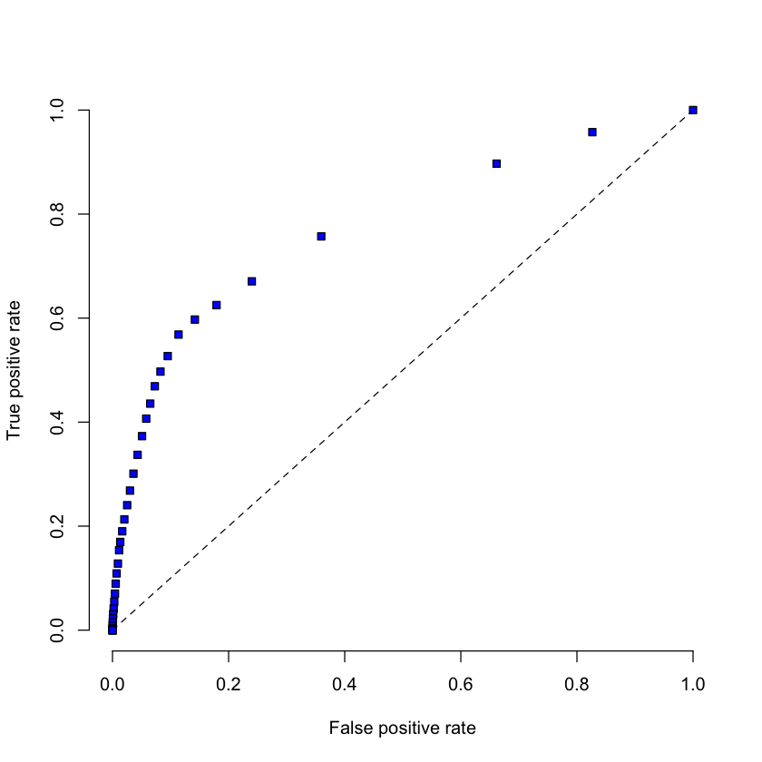

# Final Project for Data Science for Business at Duke
This is the final project for the class Data Science for Business (Decision 520Q.)

**Professor:** Dr. Natesh Pillai

**Team members:** Aaron Rodriguez, Davide Sgarbi, Flora Yang, Yin-Ta Pan

**Data Description:** The dataset comes from the University of California - Irvine, Machine Learning Repository. This is the [link](https://archive.ics.uci.edu/ml/datasets/Bank%2BMarketing) for the data. 

**citation**
*[Moro et al., 2014] S. Moro, P. Cortez and P. Rita. A Data-Driven Approach to Predict the Success of Bank Telemarketing. Decision Support Systems, Elsevier, 62:22-31, June 2014*

*Codes in code folder are from professor Dr. Natesh Pillai*

## Data Preparation


```R
data = read.csv("./data/bank-additional/bank-additional-full.csv",sep=';')
names(data)
dim(data)
head(data)
```


<ol class=list-inline>
	<li>'age'</li>
	<li>'job'</li>
	<li>'marital'</li>
	<li>'education'</li>
	<li>'default'</li>
	<li>'housing'</li>
	<li>'loan'</li>
	<li>'contact'</li>
	<li>'month'</li>
	<li>'day_of_week'</li>
	<li>'duration'</li>
	<li>'campaign'</li>
	<li>'pdays'</li>
	<li>'previous'</li>
	<li>'poutcome'</li>
	<li>'emp.var.rate'</li>
	<li>'cons.price.idx'</li>
	<li>'cons.conf.idx'</li>
	<li>'euribor3m'</li>
	<li>'nr.employed'</li>
	<li>'y'</li>
</ol>


<ol class=list-inline>
	<li>41188</li>
	<li>21</li>
</ol>


<table>
<thead><tr><th scope=col>age</th><th scope=col>job</th><th scope=col>marital</th><th scope=col>education</th><th scope=col>default</th><th scope=col>housing</th><th scope=col>loan</th><th scope=col>contact</th><th scope=col>month</th><th scope=col>day_of_week</th><th scope=col>⋯</th><th scope=col>campaign</th><th scope=col>pdays</th><th scope=col>previous</th><th scope=col>poutcome</th><th scope=col>emp.var.rate</th><th scope=col>cons.price.idx</th><th scope=col>cons.conf.idx</th><th scope=col>euribor3m</th><th scope=col>nr.employed</th><th scope=col>y</th></tr></thead>
<tbody>
	<tr><td>56         </td><td>housemaid  </td><td>married    </td><td>basic.4y   </td><td>no         </td><td>no         </td><td>no         </td><td>telephone  </td><td>may        </td><td>mon        </td><td>⋯          </td><td>1          </td><td>999        </td><td>0          </td><td>nonexistent</td><td>1.1        </td><td>93.994     </td><td>-36.4      </td><td>4.857      </td><td>5191       </td><td>no         </td></tr>
	<tr><td>57         </td><td>services   </td><td>married    </td><td>high.school</td><td>unknown    </td><td>no         </td><td>no         </td><td>telephone  </td><td>may        </td><td>mon        </td><td>⋯          </td><td>1          </td><td>999        </td><td>0          </td><td>nonexistent</td><td>1.1        </td><td>93.994     </td><td>-36.4      </td><td>4.857      </td><td>5191       </td><td>no         </td></tr>
	<tr><td>37         </td><td>services   </td><td>married    </td><td>high.school</td><td>no         </td><td>yes        </td><td>no         </td><td>telephone  </td><td>may        </td><td>mon        </td><td>⋯          </td><td>1          </td><td>999        </td><td>0          </td><td>nonexistent</td><td>1.1        </td><td>93.994     </td><td>-36.4      </td><td>4.857      </td><td>5191       </td><td>no         </td></tr>
	<tr><td>40         </td><td>admin.     </td><td>married    </td><td>basic.6y   </td><td>no         </td><td>no         </td><td>no         </td><td>telephone  </td><td>may        </td><td>mon        </td><td>⋯          </td><td>1          </td><td>999        </td><td>0          </td><td>nonexistent</td><td>1.1        </td><td>93.994     </td><td>-36.4      </td><td>4.857      </td><td>5191       </td><td>no         </td></tr>
	<tr><td>56         </td><td>services   </td><td>married    </td><td>high.school</td><td>no         </td><td>no         </td><td>yes        </td><td>telephone  </td><td>may        </td><td>mon        </td><td>⋯          </td><td>1          </td><td>999        </td><td>0          </td><td>nonexistent</td><td>1.1        </td><td>93.994     </td><td>-36.4      </td><td>4.857      </td><td>5191       </td><td>no         </td></tr>
	<tr><td>45         </td><td>services   </td><td>married    </td><td>basic.9y   </td><td>unknown    </td><td>no         </td><td>no         </td><td>telephone  </td><td>may        </td><td>mon        </td><td>⋯          </td><td>1          </td><td>999        </td><td>0          </td><td>nonexistent</td><td>1.1        </td><td>93.994     </td><td>-36.4      </td><td>4.857      </td><td>5191       </td><td>no         </td></tr>
</tbody>
</table>


```R
# percentage of people with pdays == 999
print(paste(round((sum(ifelse(data$pdays == 999,1,0))/41188)*100,2),"%",sep=""))
```

    [1] "96.32%"


```R
# percentage of people with previous == 0
print(paste(round((sum(ifelse(data$previous == 0,1,0))/41188)*100,2),"%",sep=""))
```

    [1] "86.34%"


```R
summary(data)
```


          age                 job            marital     
     Min.   :17.00   admin.     :10422   divorced: 4612  
     1st Qu.:32.00   blue-collar: 9254   married :24928  
     Median :38.00   technician : 6743   single  :11568  
     Mean   :40.02   services   : 3969   unknown :   80  
     3rd Qu.:47.00   management : 2924                   
     Max.   :98.00   retired    : 1720                   
                     (Other)    : 6156                   
                   education        default         housing           loan      
     university.degree  :12168   no     :32588   no     :18622   no     :33950  
     high.school        : 9515   unknown: 8597   unknown:  990   unknown:  990  
     basic.9y           : 6045   yes    :    3   yes    :21576   yes    : 6248  
     professional.course: 5243                                                  
     basic.4y           : 4176                                                  
     basic.6y           : 2292                                                  
     (Other)            : 1749                                                  
          contact          month       day_of_week    duration     
     cellular :26144   may    :13769   fri:7827    Min.   :   0.0  
     telephone:15044   jul    : 7174   mon:8514    1st Qu.: 102.0  
                       aug    : 6178   thu:8623    Median : 180.0  
                       jun    : 5318   tue:8090    Mean   : 258.3  
                       nov    : 4101   wed:8134    3rd Qu.: 319.0  
                       apr    : 2632               Max.   :4918.0  
                       (Other): 2016                               
        campaign          pdays          previous            poutcome    
     Min.   : 1.000   Min.   :  0.0   Min.   :0.000   failure    : 4252  
     1st Qu.: 1.000   1st Qu.:999.0   1st Qu.:0.000   nonexistent:35563  
     Median : 2.000   Median :999.0   Median :0.000   success    : 1373  
     Mean   : 2.568   Mean   :962.5   Mean   :0.173                      
     3rd Qu.: 3.000   3rd Qu.:999.0   3rd Qu.:0.000                      
     Max.   :56.000   Max.   :999.0   Max.   :7.000                      
                                                                         
      emp.var.rate      cons.price.idx  cons.conf.idx     euribor3m    
     Min.   :-3.40000   Min.   :92.20   Min.   :-50.8   Min.   :0.634  
     1st Qu.:-1.80000   1st Qu.:93.08   1st Qu.:-42.7   1st Qu.:1.344  
     Median : 1.10000   Median :93.75   Median :-41.8   Median :4.857  
     Mean   : 0.08189   Mean   :93.58   Mean   :-40.5   Mean   :3.621  
     3rd Qu.: 1.40000   3rd Qu.:93.99   3rd Qu.:-36.4   3rd Qu.:4.961  
     Max.   : 1.40000   Max.   :94.77   Max.   :-26.9   Max.   :5.045  
                                                                       
      nr.employed     y        
     Min.   :4964   no :36548  
     1st Qu.:5099   yes: 4640  
     Median :5191              
     Mean   :5167              
     3rd Qu.:5228              
     Max.   :5228              
                               


### Notes
1. Add new Column - Married_Ind: 1 if married else 0
2. Add new Column - University_Ind: 1 if person has university.degree else 0
3. Add new Column - Professional_Ind: 1 if persson has professional.course else 0
4. 96.32% clients was not previous contacted (pdays == 999) -> pdays might not be important and could be dropped


```R
data$Married_Ind = ifelse(data$marital == "married",1,0)
data$University_Ind = ifelse(data$education == "university.degree",1,0)
data$Professional_Ind = ifelse(data$education == "professional.course",1,0)
data$Cold_Call_Ind = ifelse(data$housing == "unknown",1,0)
```


```R
drops <- c("pdays")
data <- data[,!(names(data) %in% drops)]
```


```R
write.csv(data,file = "./data/Clean_Data.csv")
```

## Exploratory Data Analysis


```R
library(dplyr)
library(corrplot)
library(ggplot2)
library(ggpubr)
```

    Warning message:
    “package ‘ggpubr’ was built under R version 3.4.1”Loading required package: magrittr


```R
remove(data)
data = read.csv("./data/Clean_Data.csv")
data = data[,-1]
dim(data)
head(data)
```


<ol class=list-inline>
	<li>41188</li>
	<li>25</li>
</ol>


<table>
<thead><tr><th scope=col>age</th><th scope=col>job</th><th scope=col>marital</th><th scope=col>education</th><th scope=col>default</th><th scope=col>housing</th><th scope=col>loan</th><th scope=col>contact</th><th scope=col>month</th><th scope=col>day_of_week</th><th scope=col>⋯</th><th scope=col>cons.price.idx</th><th scope=col>cons.conf.idx</th><th scope=col>euribor3m</th><th scope=col>nr.employed</th><th scope=col>y</th><th scope=col>Married_Ind</th><th scope=col>University_Ind</th><th scope=col>Professional_Ind</th><th scope=col>Cold_Call_Ind</th><th scope=col>No_Higher_Edu_Ind</th></tr></thead>
<tbody>
	<tr><td>56         </td><td>housemaid  </td><td>married    </td><td>basic.4y   </td><td>no         </td><td>no         </td><td>no         </td><td>telephone  </td><td>may        </td><td>mon        </td><td>⋯          </td><td>93.994     </td><td>-36.4      </td><td>4.857      </td><td>5191       </td><td>no         </td><td>1          </td><td>0          </td><td>0          </td><td>0          </td><td>1          </td></tr>
	<tr><td>57         </td><td>services   </td><td>married    </td><td>high.school</td><td>unknown    </td><td>no         </td><td>no         </td><td>telephone  </td><td>may        </td><td>mon        </td><td>⋯          </td><td>93.994     </td><td>-36.4      </td><td>4.857      </td><td>5191       </td><td>no         </td><td>1          </td><td>0          </td><td>0          </td><td>0          </td><td>1          </td></tr>
	<tr><td>37         </td><td>services   </td><td>married    </td><td>high.school</td><td>no         </td><td>yes        </td><td>no         </td><td>telephone  </td><td>may        </td><td>mon        </td><td>⋯          </td><td>93.994     </td><td>-36.4      </td><td>4.857      </td><td>5191       </td><td>no         </td><td>1          </td><td>0          </td><td>0          </td><td>0          </td><td>1          </td></tr>
	<tr><td>40         </td><td>admin.     </td><td>married    </td><td>basic.6y   </td><td>no         </td><td>no         </td><td>no         </td><td>telephone  </td><td>may        </td><td>mon        </td><td>⋯          </td><td>93.994     </td><td>-36.4      </td><td>4.857      </td><td>5191       </td><td>no         </td><td>1          </td><td>0          </td><td>0          </td><td>0          </td><td>1          </td></tr>
	<tr><td>56         </td><td>services   </td><td>married    </td><td>high.school</td><td>no         </td><td>no         </td><td>yes        </td><td>telephone  </td><td>may        </td><td>mon        </td><td>⋯          </td><td>93.994     </td><td>-36.4      </td><td>4.857      </td><td>5191       </td><td>no         </td><td>1          </td><td>0          </td><td>0          </td><td>0          </td><td>1          </td></tr>
	<tr><td>45         </td><td>services   </td><td>married    </td><td>basic.9y   </td><td>unknown    </td><td>no         </td><td>no         </td><td>telephone  </td><td>may        </td><td>mon        </td><td>⋯          </td><td>93.994     </td><td>-36.4      </td><td>4.857      </td><td>5191       </td><td>no         </td><td>1          </td><td>0          </td><td>0          </td><td>0          </td><td>1          </td></tr>
</tbody>
</table>


We can devide our variables into three parts:
1. Customer Information: age/ job/ marital/ education/ default/ housing/ loan
2. Information about last call: contact/ month/ day_of_week/ duration/ campaign/ previous/ poutcome
3. Social Index: emp.var.rate/ cons.price.idx/ cons.conif.idx/ euribor3m/ nr.employed

### Analyze for the information about the customers
1. Obviously, there are some strong relationship between age and job (older people are more likely to be retired) as well as age and marriage status (old people are more likely to be married)
2. There are some relationship between education and job (people with university degree are less likely to work as blue-collar and more likely to work as management; in contrast, people with basic.6y, basic.9y are more likely to work as blue-collar)(people with professional courses tend to be technician)
3. People with unknown default, unknown loan and unknown hosing are the same guys
4. Seldom variables are directly correlated to the probability of the y
5. Even the correlation between age and y is small, it seems to be a non-linear correlation between them


```R
chat = select(data,age,job,Married_Ind,education,default,housing,loan,y)
chat = model.matrix(~.,data=chat)[,-1]
M = cor(chat)
corrplot(M,method = "square") ## draw correlation plot
plot(data$y~data$age,col=c("blue4","cyan3"),xlab = "Age",ylab=" ") # there is a non-linear correlation between age and success
```








### Analyze the last call
1. The type of contact seems to change in different months (there are some correlation between contact and months)
2. The contact & months have some correlation with y, but as they are also correlated with themselves, it is hard to conclude that if different months affect the outcome or different type of contact affect the outcome
3. Duration is highly correlated with y, but we cannot use it in our model
4. Previous and y also have strong positive correlation
5. Previous outcome can also be a good indicator for the outcome: people with previous success tend to say ”Yes” this time.


```R
HIS = select(data,contact,month,day_of_week,campaign,previous,poutcome,duration,y)
HIS = model.matrix(~.,data=HIS)[,-1]
M = cor(HIS)
corrplot(M,method = "square")
```





```R
ch_month = function(x){
  if(x=="apr"){return("2_Arp")}
  else if (x=="aug"){return("6_Aug")}
  else if (x=="dec"){return("92_Dec")}
  else if (x=="jul"){return("5_Jul")}
  else if (x=="jun"){return("4_Jun")}
  else if (x=="mar"){return("1_Mar")}
  else if (x=="may"){return("3_May")}
  else if (x=="nov"){return("91_Nov")}
  else if (x=="oct"){return("8_Oct")}
  else if (x=="sep"){return("7_Sep")}
}
```


```R
data$month2 = sapply(data$month,ch_month)
data$new_y = ifelse(data$y == "yes",1,0)
prob_in_month = aggregate(data$new_y, by=list(Category=data$month2), FUN=mean)
prob_in_month
tdata = arrange(data,month2)
ggplot(data=tdata,aes(month2))+geom_bar(fill="#008ae6")+facet_grid(contact ~ .)+
  xlab("Month")
```


<table>
<thead><tr><th scope=col>Category</th><th scope=col>x</th></tr></thead>
<tbody>
	<tr><td>1_Mar     </td><td>0.50549451</td></tr>
	<tr><td>2_Arp     </td><td>0.20478723</td></tr>
	<tr><td>3_May     </td><td>0.06434745</td></tr>
	<tr><td>4_Jun     </td><td>0.10511470</td></tr>
	<tr><td>5_Jul     </td><td>0.09046557</td></tr>
	<tr><td>6_Aug     </td><td>0.10602137</td></tr>
	<tr><td>7_Sep     </td><td>0.44912281</td></tr>
	<tr><td>8_Oct     </td><td>0.43871866</td></tr>
	<tr><td>91_Nov    </td><td>0.10143867</td></tr>
	<tr><td>92_Dec    </td><td>0.48901099</td></tr>
</tbody>
</table>





#### Notes for the relation between ways of calling and months
1. The company tends to use more telephone in May, June and July, and the performance in these three months are seemed to be not good
2. If we can make sure that there is a huge difference between the three months and other months, we can conclude that the telephone might not be a good way to cold-call

### Analyze the economic indexes
1. Social indexes are really important for predicting the outcome
2. However, those indexes are also highly correlated with each others > be careful when we use them


```R
SOC = select(data,emp.var.rate,cons.price.idx,cons.conf.idx,euribor3m,nr.employed,y)
SOC = model.matrix(~.,data=SOC)[,-1]
M = cor(SOC)
corrplot(M,method = "square")
emp.var.rate = ggplot(data,aes(emp.var.rate,new_y))+geom_count()+ylab("")+scale_y_continuous(breaks=c(0,1))
cons.price.idx = ggplot(data,aes(cons.price.idx,new_y))+geom_count()+ylab("")+scale_y_continuous(breaks=c(0,1))
cons.conf.idx = ggplot(data,aes(cons.conf.idx,new_y))+geom_count()+ylab("")+scale_y_continuous(breaks=c(0,1))
euribor3m = ggplot(data,aes(euribor3m,new_y))+geom_count()+ylab("")+scale_y_continuous(breaks=c(0,1))
nr.employed = ggplot(data,aes(nr.employed,new_y))+geom_count()+ylab("")+scale_y_continuous(breaks=c(0,1))
ggarrange(emp.var.rate,cons.price.idx,cons.conf.idx,euribor3m,nr.employed,ncol=2,nrow=3)
```








### PCA for the three parts


```R
d1 = data.frame(model.matrix(~age+job+marital+education+default+housing+loan,data=data)[,-1])
pca1 = prcomp(formula = ~.,data=d1,scale=T)
d2 = data.frame(model.matrix(~contact+month+day_of_week+campaign+previous+poutcome,data=data)[,-1])
pca2 = prcomp(formula = ~.,data=d2,scale=T)
d3 = data.frame(model.matrix(~emp.var.rate+cons.price.idx+cons.conf.idx+euribor3m+nr.employed,data=data)[,-1])
pca3 = prcomp(formula = ~.,data=d3,scale=T)
pca_data = data.frame(cbind(pca1$x[,1:10],pca2$x[,1:10],pca3$x[,1:2]))
y = data$y
pca_data = data.frame(cbind(pca_data,y))
pca_data$y = ifelse(pca_data$y == 'yes', 1, 0)
```

#### Notes for PCA results
1. The purpose for PCA is to find whether there are some correlation between the three types of information
2. We can run principal component analysis on the three types separately
3. We can choose 10 factors for information about character; 10 factors for the information about the last call; 2 factors for the social indexes


```R
par(mfrow=c(1,3))
plot(pca1,type="line")
plot(pca2,type="line")
plot(pca3,type="line")
```


There is no strong correlation between the three types of information


```R
M = cor(pca_data)
corrplot(M)
```





## Modeling
### Comparing different models 
1. m.lr : logistic regression
2. m.lr.l : logistic regression with interaction using lasso 
3. m.pca : pca model
4. m.lr.tree : classification tree


```R
#library(glmnet)
library(tree)
#source("./code/lasso_aux.R")
#source("./code/deviance_2015.R")
#source("./code/FPR_TPR.R")
#source("./code/PerformanceCurves.R")
```


```R
# Data process
#drop the first column (id)
BankData = data
#drop marital column (already married index)
BankData = BankData[,-3]
#drop education column (already education index)
BankData = BankData[,-3]
#drop ColdCallInd
BankData = BankData[,-22]
#take off duration
duration = BankData[,9]
BankData = BankData[,-9]
#make y an index
BankData$y = ifelse(BankData$y == "no", 0, 1)
#drop unknown values for housing
BankData = BankData[BankData$housing != "unknown",]
#drop nr.employed
BankData = BankData[,-16]
#create factor variables
BankData$job = as.factor(BankData$job)
BankData$default = as.factor(BankData$default)
BankData$housing = as.factor(BankData$housing)
BankData$loan = as.factor(BankData$loan)
BankData$contact = as.factor(BankData$contact)
BankData$poutcome = as.factor(BankData$poutcome)
BankData$y = as.factor(BankData$y)
BankData$Married_Ind = as.factor(BankData$Married_Ind)
BankData$University_Ind = as.factor(BankData$University_Ind)
BankData$Professional_Ind = as.factor(BankData$Professional_Ind)
BankData$No_Higher_Edu_Ind = as.factor(BankData$No_Higher_Edu_Ind)
BankData$month = as.factor(BankData$month)
BankData$day_of_week = as.factor(BankData$day_of_week)
```


```R
newMx = model.matrix(y ~ .^2, data=BankData)[,-1]
newMy = BankData$y
```


```R
set.seed(123)
subset = sample(nrow(newMx), 10000)
Mx = newMx[subset,]
My<- BankData$y[subset] == 1
```


```R
## Use the theory to select the optimal value of lambda
num.features <- ncol(Mx)
num.n <- nrow(Mx)
num.churn <- sum(My)
w <- (num.churn/num.n)*(1-(num.churn/num.n))
lambda.theory <- sqrt(w*log(num.features/0.05)/num.n)
```


```R
## and finally let's run lasso for the value of lambda we just found
lassoTheory <- glmnet(Mx,My, family="binomial",lambda = lambda.theory)
summary(lassoTheory)
support(lassoTheory$beta)
```


               Length Class     Mode     
    a0           1    -none-    numeric  
    beta       889    dgCMatrix S4       
    df           1    -none-    numeric  
    dim          2    -none-    numeric  
    lambda       1    -none-    numeric  
    dev.ratio    1    -none-    numeric  
    nulldev      1    -none-    numeric  
    npasses      1    -none-    numeric  
    jerr         1    -none-    numeric  
    offset       1    -none-    logical  
    classnames   2    -none-    character
    call         5    -none-    call     
    nobs         1    -none-    numeric  


<ol class=list-inline>
	<li>36</li>
	<li>79</li>
	<li>150</li>
	<li>306</li>
	<li>327</li>
	<li>370</li>
	<li>436</li>
	<li>478</li>
	<li>488</li>
	<li>655</li>
	<li>688</li>
	<li>691</li>
	<li>708</li>
	<li>711</li>
	<li>728</li>
	<li>736</li>
	<li>739</li>
	<li>742</li>
	<li>772</li>
	<li>837</li>
	<li>846</li>
	<li>849</li>
	<li>855</li>
	<li>859</li>
	<li>866</li>
	<li>875</li>
</ol>


```R
## these are the variables selected by the regularization via lasso. Let's apply them to our dataset

features.min <- support(lassoTheory$beta)
length(features.min)
data.min <- data.frame(newMx[,features.min],newMy)
```


26


```R
## 10-fold cross validation

PerformanceMeasure <- function(actual, prediction, threshold=.3) {
  R2(y=actual, pred=prediction, family="binomial")
}

n <- nrow(BankData)
nfold <- 10
OOS <- data.frame(m.lr=rep(NA,nfold), m.lr.pl=rep(NA,nfold), m.pca=rep(NA, nfold), m.tree=rep(NA,nfold), m.average=rep(NA,nfold)) 
foldid <- rep(1:nfold,each=ceiling(n/nfold))[sample(1:n)]

for(k in 1:nfold){ 
  train <- which(foldid!=k) # train on all but fold `k'
  
  ### Logistic regression
  m.lr <-glm(y~., data=BankData, subset=train,family="binomial")
  pred.lr <- predict(m.lr, newdata=BankData[-train,], type="response")
  OOS$m.lr[k] <- PerformanceMeasure(actual=newMy[-train], pred=pred.lr)
  
  
  ### the Post Lasso Estimates
  m.lr.pl <- glm(newMy~., data=data.min, subset=train, family="binomial")
  pred.lr.pl <- predict(m.lr.pl, newdata=data.min[-train,], type="response")
  OOS$m.lr.pl[k] <- PerformanceMeasure(actual=newMy[-train], prediction=pred.lr.pl)
  
  
  ### PCA estimates
  m.pca = glm(y ~ ., data = pca_data, subset=train, family = "binomial")
  pred.pca = predict(m.pca, newdata = pca_data[-train,], type="response")
  OOS$m.pca[k] <- PerformanceMeasure(actual=pca_data[-train,"y"], prediction=pred.pca)

  
  ### the classification tree
  m.tree <- tree(y~ ., data=BankData, subset=train) 
  pred.tree <- predict(m.tree, newdata=BankData[-train,], type="vector")
  pred.tree <- pred.tree[,2]
  OOS$m.tree[k] <- PerformanceMeasure(actual=newMy[-train], prediction=pred.tree)
  
  pred.m.average <- rowMeans(cbind(pred.tree, pred.lr.pl, pred.lr, pred.lr))
  OOS$m.average[k] <- PerformanceMeasure(actual=newMy[-train], prediction=pred.m.average)
  
  print(paste("Iteration",k,"of",nfold,"completed"))
  
}
```

    [1] "Iteration 1 of 10 completed"
    [1] "Iteration 2 of 10 completed"
    [1] "Iteration 3 of 10 completed"
    [1] "Iteration 4 of 10 completed"
    [1] "Iteration 5 of 10 completed"
    [1] "Iteration 6 of 10 completed"
    [1] "Iteration 7 of 10 completed"
    [1] "Iteration 8 of 10 completed"
    [1] "Iteration 9 of 10 completed"
    [1] "Iteration 10 of 10 completed"


The PCA model seems to be the best model, based on the R-squared


```R
## Let's plot a boxplot
names(OOS)[1] <-"logistic"
names(OOS)[2] <-"lasso"
names(OOS)[3] <-"pca"
names(OOS)[4] <-"tree"
names(OOS)[5] <-"average"
boxplot(OOS, col="plum", las = 2, ylab=expression(paste("OOS ",R^2)), xlab="", main="10-fold Cross Validation")
```


```R
### Lets plot FPR and TPR for the PCA model for different tresholds
plot( c( 0, 1 ), c(0, 1), type="n", xlim=c(0,1), ylim=c(0,1), bty="n", xlab = "False positive rate", ylab="True positive rate")
lines(c(0,1),c(0,1), lty=2)
m.pca = glm(y ~ ., data = pca_data, family = "binomial")
for( val in seq(from=0,to=1,by=0.025)){
  values <- FPR_TPR( predict(m.pca, type="response") >= val, pca_data[,"y"])
  points( values[1] , values[2], pch = 22, bg="blue" )
}
```




